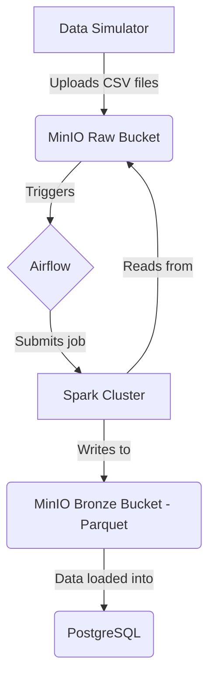

# Data Pipeline with Spark and Airflow

[](https://github.com/thiiagowilliam/data-pipeline-spark-airflow/actions/workflows/ci-cd.yaml)
[](https://opensource.org/licenses/MIT)
[](https://example.com/coverage)

An ETL pipeline for processing simulated data using Apache Spark and Apache Airflow, with MinIO as a data lake and PostgreSQL for metadata and results.

## Overview

This project demonstrates a complete ETL (Extract, Transform, Load) data pipeline. It includes:

*   **Data Simulation**: A Python script to generate fake customer and sales data and upload it to a MinIO bucket.
*   **Orchestration**: An Apache Airflow DAG that triggers the Spark job when new data is available.
*   **Processing**: An Apache Spark job that reads the raw data from MinIO, transforms it, and writes it back to the data lake in Parquet format (Bronze layer).
*   **Storage**: MinIO is used as a data lake for raw and processed data. PostgreSQL stores Airflow's metadata and the final transformed data.

## Architecture

The following diagram illustrates the architecture of the pipeline:



## Setup Instructions

### Prerequisites

*   Docker
*   Docker Compose

### Installation

1.  Clone the repository:
    ```bash
    git clone https://github.com/thiiagowilliam/data-pipeline-spark-airflow.git
    cd data-pipeline-spark-airflow
    ```

2.  Build and start the services using Docker Compose:
    ```bash
    docker-compose up --build -d
    ```

This will start the following services:

*   Airflow Webserver (available at `http://localhost:8085`)
*   Airflow Scheduler, Worker, and Init
*   Spark Master and Worker
*   PostgreSQL
*   MinIO (available at `http://localhost:9001` with user/password `minioadmin/minioadmin`)
*   Redis

## How to Run

1.  **Generate and upload data**:

    Run the data simulator to generate and upload data to MinIO:

    ```bash
    python3 simulator/simulador_csv.py
    ```

2.  **Trigger the Airflow DAG**:

    *   Open the Airflow UI at `http://localhost:8085` (user/password `admin/admin`).
    *   Enable and trigger the `s3_spark_processing_pipeline` DAG.

## Data Flow

1.  The **Data Simulator** generates `clientes.csv` and `vendas.csv` files and uploads them to the `raw/` directory in the `datalake` bucket in MinIO.
2.  The `S3KeySensor` in the Airflow DAG detects the new files.
3.  The DAG triggers a **Spark job**.
4.  The Spark job reads the CSV files from the `raw/` directory, infers the schema, and converts them to Parquet format.
5.  The Parquet files are written to the `bronze/` directory in the `datalake` bucket, partitioned by dataset (`clientes` or `vendas`).
6.  The data from the Parquet files is then loaded into the `clientes` and `vendas` tables in the **PostgreSQL** database.

## Data Contracts

Data contracts are defined in the `contracts/` directory. They describe the expected schema for the data at different stages of the pipeline.

*   `clientes.json`: Schema for the customers data.
*   `vendas.json`: Schema for the sales data.
*   `sales_contract.json`: Data quality rules for the sales data, to be used with a framework like Great Expectations.

These contracts are crucial for ensuring data quality and consistency.

## Contributing

Contributions are welcome! Please read our [CONTRIBUTING.md](CONTRIBUTING.md) for details on how to contribute to this project.