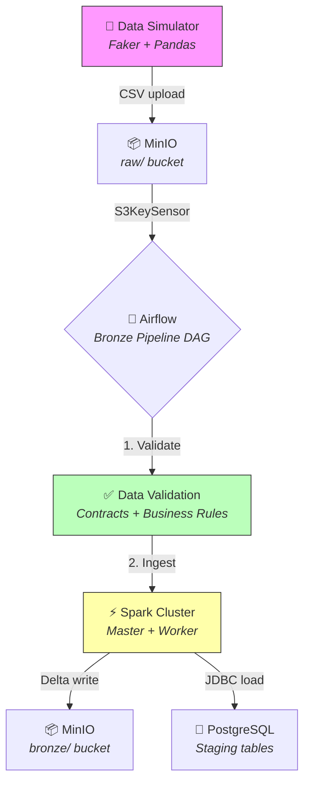

# Data Pipeline — Spark + Airflow + Delta Lake

[](https://github.com/thiiagowilliam/data-pipeline-spark-airflow/actions/workflows/ci-cd.yaml)
[](https://opensource.org/licenses/MIT)
[](https://www.python.org/downloads/release/python-3110/)
[](https://spark.apache.org/)
[](https://airflow.apache.org/)
[](https://delta.io/)

Pipeline ETL completo para processamento de dados simulados, com validação de qualidade via contratos de dados, ingestão em Delta Lake e carga em PostgreSQL — orquestrado por Apache Airflow.

## Tech Stack

| Componente | Tecnologia | Função |
|-----------|-----------|--------|
| **Orquestração** | Apache Airflow 2.11 + CeleryExecutor | Scheduling, DAGs, monitoramento |
| **Processamento** | Apache Spark 3.5.1 (PySpark) | Transformação distribuída |
| **Storage Format** | Delta Lake 3.2 | ACID transactions, time travel |
| **Data Lake** | MinIO (S3-compatible) | Object storage para raw e bronze |
| **Data Warehouse** | PostgreSQL 16 | Armazenamento relacional |
| **Data Quality** | Great Expectations + Data Contracts | Validação de schema e regras de negócio |
| **Message Broker** | Redis 7 | Celery task queue |
| **CI/CD** | GitHub Actions | Lint, testes, verificação de DAG |
| **Containerização** | Docker Compose | Ambiente completo em containers |

## Architecture



## Project Structure

```
├── airflow/
│   └── dags/
│       ├── bronze_pipeline.py          # DAG principal — orquestração
│       └── scripts/spark_jobs/
│           ├── spark_config.py         # Configuração centralizada Spark
│           ├── validate.py             # DataValidator (schema, tipos, regras)
│           ├── validate_data.py        # Spark job — validação standalone
│           └── bronze_ingest.py        # Spark job — ingestão Delta + Postgres
├── contracts/                          # Contratos de dados (JSON schemas)
│   ├── clientes.json
│   ├── vendas.json
│   └── sales_contract.json
├── great_expectations/                 # Suites de validação GE
│   └── expectations/
│       ├── clientes_suite.json
│       └── vendas_suite.json
├── simulator/
│   └── data_simulator.py              # Gerador de dados simulados
├── database/
│   └── tables.sql                      # DDL das tabelas PostgreSQL
├── tests/
│   └── test_data_simulator.py          # Testes unitários
├── docs/                               # Documentação detalhada
├── docker-compose.yaml                 # Stack completa (9 services)
├── Dockerfile.airflow                  # Imagem Airflow customizada
├── Dockerfile.spark                    # Imagem Spark customizada
├── Makefile                            # Automação de comandos
└── .github/workflows/ci-cd.yaml       # Pipeline CI/CD
```

## Key Features

- **📋 Data Contracts** — Schemas JSON que definem a estrutura esperada dos dados para cada dataset
- **✅ Data Validation Layer** — Validação automatizada de schema, tipos, nulos e regras de negócio antes da ingestão
- **📊 Validation Reports** — Relatórios estruturados com métricas de conformidade por arquivo
- **🔄 Idempotent Processing** — Controle de metadata para evitar reprocessamento de arquivos
- **🏗️ Delta Lake** — ACID transactions e schema enforcement na camada bronze
- **📈 Spark History Server** — Monitoramento de jobs Spark com histórico completo
- **🐳 Full Docker Stack** — 9 serviços containerizados prontos para uso local

## Quick Start

### Prerequisites

- Docker & Docker Compose
- Make (opcional, para atalhos)

### Setup

```bash
# Clone o repositório
git clone https://github.com/thiiagowilliam/data-pipeline-spark-airflow.git
cd data-pipeline-spark-airflow

# Suba a stack completa
make up
# ou: docker compose up --build -d

# Gere dados simulados
make simulate
# ou: cd simulator && python data_simulator.py
```

### Serviços Disponíveis

| Serviço | URL | Credenciais |
|---------|-----|-------------|
| Airflow UI | http://localhost:8085 | `admin` / `admin` |
| MinIO Console | http://localhost:9001 | `minioadmin` / `minioadmin` |
| Spark Master UI | http://localhost:8081 | — |
| Spark History | http://localhost:18080 | — |
| PostgreSQL | `localhost:5433` | `airflow` / `airflow` |

### Pipeline Execution

1. Execute o **Data Simulator** para gerar CSVs e enviar ao MinIO
2. Ative o DAG `bronze_data_pipeline` no Airflow UI
3. O pipeline executa automaticamente: **detect → filter → validate → ingest**

## Data Flow

```
raw/clientes/*.csv  ─┐
                     ├→ S3KeySensor → Filter New Files → Validate → Delta Lake → PostgreSQL
raw/vendas/*.csv    ─┘
```

1. O **Data Simulator** gera `clientes_*.csv` e `vendas_*.csv` e envia para `s3a://datalake/raw/`
2. O `S3KeySensor` detecta os novos arquivos no MinIO
3. O DAG filtra arquivos já processados via metadata no PostgreSQL
4. O **Spark Validation Job** valida cada arquivo contra os contratos de dados
5. O **Spark Ingest Job** converte para **Delta Lake** em `s3a://datalake/bronze/`
6. Os dados são carregados nas tabelas staging do **PostgreSQL**

## Documentation

- [Architecture](docs/architecture.md) — Visão geral dos componentes e fluxo de dados
- [Data Model](docs/data-model.md) — Schemas, contratos e modelo de dados
- [Troubleshooting](docs/troubleshooting.md) — Problemas comuns e soluções

## Contributing

Contributions are welcome! Please read [CONTRIBUTING.md](CONTRIBUTING.md) for details.