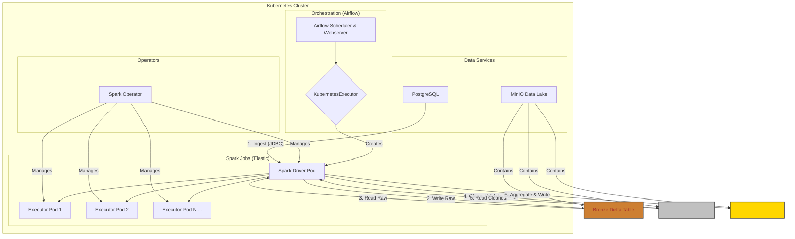

# Scalable Data Lakehouse: A Production-Ready Medallion Pipeline

[](https://github.com/your-username/pyspark-data-pipeline/actions/workflows/ci-cd.yaml)
[](https://www.python.org/downloads/release/python-3110/)
[](https://spark.apache.org/)
[](https://kubernetes.io/)
[](https://opensource.org/licenses/MIT)

This project demonstrates a production-grade, end-to-end, and elastic data pipeline built on a modern data stack. It implements a **Medallion Lakehouse architecture** orchestrated by **Airflow**, with **PySpark** jobs running elastically on a **Kubernetes** cluster via the **Spark on Kubernetes Operator**.

The primary goal is to provide a blueprint for building scalable, cost-efficient, and maintainable data platforms that are ready for production workloads.

---

## Core Concepts Demonstrated

*   **Medallion Architecture:** Data is progressively refined through Bronze (raw), Silver (cleaned), and Gold (aggregated) layers using Delta Lake for reliability and time travel.
*   **True Elasticity with Spark on Kubernetes:** Jobs request resources on-demand, and the cluster scales executors up and down automatically (`spark.dynamicAllocation.enabled=true`). This is the key to a cost-effective and scalable platform.
*   **Infrastructure as Code (IaC):** The entire platform (Airflow, MinIO, Postgres, Spark Operator) is deployed and managed declaratively using Helm charts on a local `k3d` Kubernetes cluster.
*   **CI/CD & Data Quality:** The pipeline includes a full CI/CD workflow using GitHub Actions for linting, testing, and image building, plus data quality gates with Great Expectations.
*   **Observability:** Centralized logging for Airflow and a persistent Spark History Server to debug and monitor job performance.

## Architecture

The diagram below illustrates the flow of data from a transactional Postgres database to an aggregated Gold layer in the MinIO Data Lake, orchestrated by Airflow on Kubernetes.



## The Power of Elasticity: Why Spark on Kubernetes Operator?

In traditional setups, a Spark cluster's resources (CPU/memory) are fixed. This leads to two problems:
1.  **Waste:** Resources are idle when no jobs are running.
2.  **Bottlenecks:** A large job may starve for resources, while a small job doesn't need the full cluster.

The **Spark on Kubernetes Operator** combined with **dynamic allocation** solves this. Each Spark job is a custom Kubernetes resource (`SparkApplication`). The operator watches for these resources and launches a dedicated, perfectly-sized Spark cluster for each one.

-   **Scale-Up:** When a job starts, it requests the executors it needs. Kubernetes schedules new pods.
-   **Scale-Down:** When executors are idle, they are automatically removed to free up resources.
-   **Isolation:** Jobs run in separate Spark clusters, preventing interference.

**This project is configured to demonstrate this behavior out-of-the-box.**
> *(Placeholder for a GIF showing `kubectl get pods -w` with Spark executor pods appearing and disappearing during a DAG run.)*

---

## Tech Stack

*   **Containerization & K8s:** Docker, `k3d` (local K3s cluster)
*   **Infrastructure:** Kubernetes, Helm
*   **Orchestration:** Apache Airflow (with KubernetesExecutor)
*   **Processing:** PySpark 3.5, Delta Lake
*   **Storage:** MinIO (S3-compatible), PostgreSQL
*   **Data Quality:** Great Expectations
*   **CI/CD:** GitHub Actions
*   **Tooling:** `black`, `ruff`, `mypy`, `pytest`

---

## Prerequisites

*   [Docker](https://docs.docker.com/get-docker/)
*   [kubectl](https://kubernetes.io/docs/tasks/tools/)
*   [helm](https://helm.sh/docs/intro/install/)
*   [k3d](https://k3d.io/v5.6.0/#installation)

---

## Quickstart Guide

**1. Create the Local Kubernetes Cluster**
```bash
# This creates a k3d cluster with 1 server and 3 agent nodes
k3d cluster create --config k3d-datalake.yaml
```

**2. Deploy Infrastructure with Helm**

First, add the required Helm repositories:
```bash
helm repo add apache-airflow https://airflow.apache.org
helm repo add spark-operator https://googlecloudplatform.github.io/spark-on-k8s-operator
helm repo add bitnami https://charts.bitnami.com/bitnami
helm repo update
```

Now, deploy the services into their dedicated namespaces:
```bash
# Deploy Spark Operator, MinIO, and Postgres
helm install spark-operator spark-operator/spark-operator --namespace spark-operator --create-namespace --values ./infra/kubernetes/charts/spark-operator-values.yaml
helm install minio bitnami/minio --namespace minio --create-namespace --values ./infra/kubernetes/charts/minio-values.yaml
helm install postgres bitnami/postgresql --namespace postgres --create-namespace --values ./infra/kubernetes/charts/postgres-values.yaml

# Deploy Airflow
helm install airflow apache-airflow/airflow --namespace airflow --create-namespace --values ./infra/kubernetes/charts/airflow-values.yaml
```

**3. Create Kubernetes Secrets**

We store credentials securely in Kubernetes secrets, which are mounted into Airflow.
```bash
# Create secrets for Postgres and MinIO connections
kubectl apply -f ./infra/kubernetes/secrets.yaml
```

**4. Build and Load Custom Docker Images**

The Spark jobs and Airflow DAGs require custom images with all dependencies.
```bash
# Build and load the images into the k3d cluster's registry
eval $(k3d registry create local-registry --port 5000)
docker build -t localhost:5000/pyspark-basic-spark:latest -f Dockerfile.spark .
docker build -t localhost:5000/pyspark-basic-airflow:latest -f Dockerfile.airflow .
docker push localhost:5000/pyspark-basic-spark:latest
docker push localhost:5000/pyspark-basic-airflow:latest
```

**5. Access the Services**

Use `kubectl port-forward` to access the UIs:
```bash
# Airflow UI (user: airflow, pass: airflow)
kubectl port-forward svc/airflow-webserver 8080:8080 --namespace airflow

# MinIO Console (user: minio, pass: minio123)
kubectl port-forward svc/minio 9001:9001 --namespace minio
```

**6. Run the Pipeline**

-   Navigate to the Airflow UI at `http://localhost:8080`.
-   Enable and trigger the `medallion_sales_pipeline` DAG.
-   Watch the pods in another terminal with `kubectl get pods -n spark-jobs -w` to see the Spark jobs and their executors spin up and down!

---

## Development & Testing

**Linting and Formatting:**
```bash
# Format with Black
black .

# Lint with Ruff
ruff check .
```

**Running Tests:**
```bash
# Run all PySpark unit tests
pytest tests/
```