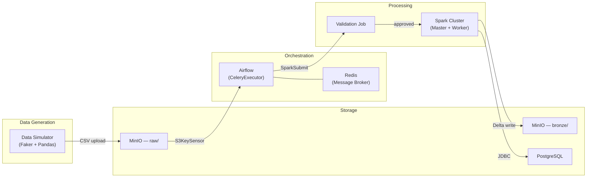

# Architecture

This document provides a detailed overview of the data pipeline's architecture.

## Components

### Data Simulator (`simulator/data_simulator.py`)

Python script that generates realistic fake data for customers (`clientes`) and sales (`vendas`) using the `Faker` library. Uploads CSV files to the MinIO `raw/` bucket on a configurable interval.

### MinIO (S3-compatible Object Storage)

- **Raw Layer** (`datalake/raw/`): CSV files generated by the simulator
- **Bronze Layer** (`datalake/bronze/`): Delta Lake tables created by the Spark ingest job

### Apache Airflow

- **DAG** (`bronze_data_pipeline`): Orchestrates the full pipeline — detection, filtering, validation, and ingestion
- **CeleryExecutor** with Redis as message broker for distributed task execution
- **Metadata tracking**: PostgreSQL table `airflow_file_metadata` prevents reprocessing

### Apache Spark

- **Validation Job** (`validate_data.py`): Validates CSV data against JSON contracts — checks schema, data types, nulls, and business rules
- **Ingest Job** (`bronze_ingest.py`): Reads validated CSVs, writes to Delta Lake, loads into PostgreSQL staging tables
- **Shared Config** (`spark_config.py`): Centralized SparkSession factory with S3A/Delta configuration

### PostgreSQL

- **Airflow Metastore**: DAGs, task instances, connections
- **Data Tables**: `clientes`, `vendas` (final structured data)
- **Metadata**: `airflow_file_metadata` (file processing tracking)

### Redis

In-memory data store used by Airflow's CeleryExecutor as a message broker for task distribution.

## Data Flow

1. The **Data Simulator** generates CSV files and uploads them to `s3a://datalake/raw/`
2. Airflow's `S3KeySensor` detects the arrival of new files in the raw bucket
3. The DAG queries `airflow_file_metadata` in PostgreSQL and filters out already-processed files
4. The **Validation Spark Job** validates each file against its data contract (schema, types, nulls, business rules)
5. If validation passes, the **Ingest Spark Job** reads the CSVs, writes Delta Lake to `s3a://datalake/bronze/`, and loads data into PostgreSQL staging tables
6. If validation fails, the pipeline is **halted** and the error is logged with a detailed report
